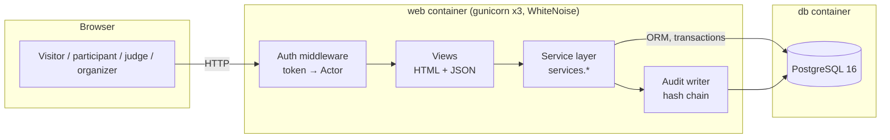
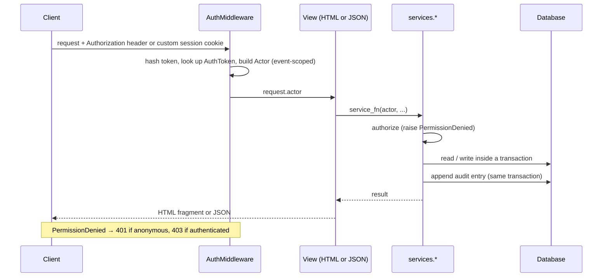

# ARCHITECTURE.md — How Rubric is put together, and why

Rubric is an open-source, self-hosted submission and judging portal for
hackathons. This document describes the shape of the system as it exists in the
repository: the stack, how a request travels through it, where each rule is
enforced, how it is packaged so that `docker compose up` works on a laptop with
the network off, and which trade-offs were taken deliberately. Companion
documents: `DATA-MODEL.md` (schema and import/export paths), `JUDGING.md` (the
scoring, normalization and threat-model reasoning), `DECISIONS.md` (25 numbered
design decisions with alternatives considered).

## Contents

1. [Goals that shaped the design](#1-goals-that-shaped-the-design)
2. [Stack, and why each piece](#2-stack-and-why-each-piece)
3. [System overview](#3-system-overview)
4. [Layering: how a request is processed](#4-layering-how-a-request-is-processed)
5. [Code map](#5-code-map)
6. [Identity, roles and authorization](#6-identity-roles-and-authorization)
7. [Data integrity mechanisms](#7-data-integrity-mechanisms)
8. [The main flows](#8-the-main-flows)
9. [Packaging and deployment](#9-packaging-and-deployment)
10. [Verification: tests and CI](#10-verification-tests-and-ci)
11. [Trade-offs and non-goals](#11-trade-offs-and-non-goals)
12. [Extending Rubric](#12-extending-rubric)

---

## 1. Goals that shaped the design

The event this project was built for asks for a portal an organizer could run on
Monday. That turned four requirements into architecture:

| Requirement | What it forced |
|---|---|
| **Runs offline with one command** | No cloud services, no CDN assets, no hosted auth. Everything (CSS, the HTMX script, fonts-free UI) is served from the container. |
| **Judging integrity** | Authorization decided in the backend by one small set of functions, not in templates; an audit trail an organizer can read and a stranger can verify. |
| **Defensible statistics** | Pure, deterministic functions for scoring and normalization, testable against planted truths. |
| **Adoptable by strangers** | Boring, widely known technology; a schema that can be exported without the application; documentation of what is *not* done. |

## 2. Stack, and why each piece

| Piece | Choice | Reason |
|---|---|---|
| Language / framework | Python 3.12, Django 5.2 (pinned `>=5.2.13`, a release that includes recent security fixes) | Mature ORM, migrations, template engine, CSRF and password hashing out of the box. Fewer moving parts to trust. |
| Database | PostgreSQL 16 in the shipped stack; SQLite for fast local test runs | Postgres gives row locks, advisory locks and trigger-enforced audit immutability. The suite runs on both. |
| UI | Server-rendered Django templates + HTMX (vendored, one static file) | No Node toolchain, no build step, no client bundle to audit. Live regions (dashboard, ballots) update with small HTML swaps. |
| Web server | gunicorn (3 workers) with WhiteNoise for static files | A single container serves both application and assets, no reverse proxy needed. |
| Auth | A standalone `AuthToken` model; bearer token in a header or custom `session` cookie (§6.1) | The checker attaches a header; browser login puts the same token in an HttpOnly cookie. Django's session-auth backend is not used. |
| API | Ordinary Django views returning `JsonResponse` / `HttpResponse` and calling the service layer | No API framework or generated OpenAPI schema is part of the shipped implementation. |
| Numerics | Standard library plus NumPy (graph Laplacian eigenvalues) | Small, well-known, no service dependencies. |

Not present, on purpose: Redis, Celery, Node, a message broker, Django admin,
external email, any third-party API at runtime.

## 3. System overview



Two containers, one command. The web container runs migrations and imports the
fixture data on start, then serves on port 8080.

## 4. Layering: how a request is processed



The rules of the layering:

1. **The middleware only identifies.** It turns a raw token into an `Actor` or an
   anonymous actor. It makes no decision about what that actor may do.
2. **Services decide.** Every state change, and every read whose visibility depends
   on the caller (judge scores, drafts, results, organizer data), goes through a
   function in `src/services/` (or the app-level service modules they wrap) that
   takes the actor as its first argument and raises `PermissionDenied` itself.
3. **HTML and JSON are two thin views of the same service call.** A form post and a
   JSON request for the same action call the same function, so there is no action
   that exists in one and not the other.
4. **Views may perform presentation-only reads.** Some views (mainly the gallery
   and organizer screens) query the ORM directly to render lists. Those routes are
   still covered by the authorization test matrix (§6.3); the deliberate line is
   that *decisions* and *writes* live in services, not that no view ever reads a
   row. This is a convention enforced by review and tests, not by the language.

## 5. Code map

```
src/
├── rubric/        settings, URLconf (47 path declarations), WSGI
├── accounts/      User, AuthToken, EventMembership, judge track eligibility,
│                  auth middleware, Actor, login/register views, auth rate limit
├── events/        Event, Track, Prize; event management services and organizer views
├── teams/         Team, TeamMembership, invite-link join
├── submissions/   Project, submission services, URL validation, safe-link template filter
├── judging/       Rubric, criteria, assignments, ballots, normalization runs, judge
│                  invites; judge console and organizer dashboards; management commands
├── voting/        VoteAttempt, Vote, Comment; public ballot, results, moderation
├── audit/         AuditLogEntry, AuditChainHead; chain verification commands
├── importer/      seed_fixtures: idempotent import of fixtures.json
├── services/      the service layer (accounts, events, teams, submissions, judging,
│                  assignment, normalization, voting, audit)
├── api/           JSON endpoints (score reads, CSV, organizer JSON, ballot submission)
├── templates/     server-rendered pages and HTMX fragments
└── static/        one stylesheet, one vendored script
tests/             Django test suite, plus the authorization matrix (authz_expectations.yaml)
scripts/           verify_audit_chain.py (offline verifier), check_no_external_assets.py
```

## 6. Identity, roles and authorization

### 6.1 Tokens instead of sessions

Authentication is a small token system. A user has zero or more `AuthToken` rows
holding **only the SHA-256 hash** of the token; the raw value exists once, at
creation. The middleware reads `Authorization: Bearer <token>` first, then the
custom `session` cookie (which browser logins set with `HttpOnly` and `SameSite=Lax`).
That cookie carries the same raw token, not a Django session key. This gives the
acceptance checker a header that stands for a role and browser users a cookie login
through one token-validation path. Passwords use Django's hasher; accounts carry
none of Django's admin baggage (decisions 1, 8).

### 6.2 Actors and roles

A request resolves to an `Actor` bound to the **current event**. The actor exposes
independent booleans, `is_participant`, `is_judge`, `is_organizer` and
`is_site_admin`, because one person may hold several roles in an event. An
anonymous actor has every flag false, so checks default closed. The five roles
required by the brief map to: visitor (anonymous), participant, judge, organizer,
and site administrator.

### 6.3 Authorization is declared and tested

`src/rubric/urls.py` has 47 actual `path()` declarations. The authorization matrix
contains a separate `peer_scores` case for the query-parameter variant of
`judge_scores`, so that probe is not a 48th URLconf route. A test fails the build if
any route has no declaration, and a second test proves that alarm can fire by
aiming it at a temporary URLconf with an undeclared route. The judge-score
isolation rule is implemented in exactly one function, `get_scores`, shared by
the base-path and peer-query checker probes (`JUDGING.md` §5).

Two rules apply beyond per-route checks:

- **Event-scoped authority.** Because one event is "current" for the whole portal,
  a naive check ("is this user an organizer?") would consult the current event even
  when editing another. Event, track, prize, rubric, invite and voting-window
  actions instead call a single helper that checks membership in the *target* event
  (decision 22).
- **CSRF depends on the credential.** Header-authenticated requests are exempt;
  cookie-authenticated and anonymous browser posts are protected (decision 9).

### 6.4 One active event

At most one event is current, enforced by a partial unique index on
`Event.is_current`. Creating an event never switches the portal to it; switching is
an explicit, audit-logged organizer action with a warning. Canonical URLs (`/`,
`/projects`, `/judge/queue`) never change, and no two organizers can see different
"current" data. Truly concurrent events are a non-goal (decision 15).

## 7. Data integrity mechanisms

| Mechanism | Where | Guards against |
|---|---|---|
| Unique / partial-unique constraints | Database (e.g. one current event, one assignment per judge and project, one vote per event/project/mode/pseudonym, one score per ballot criterion) | Duplicates and races that application code could miss |
| Transactions with row locks | Submissions near the deadline, vote casting and withdrawal (PostgreSQL row lock on the event; a process mutex on SQLite for tests) | Racing the deadline, exceeding a vote budget |
| Hash-chained, append-only audit log | `audit` app; entries written in the same transaction as the change; PostgreSQL triggers reject update, delete and truncate | Silent edits to history |
| Append-only vote attempts | ORM guards on `VoteAttempt` | Rewriting abuse evidence in application code |
| Deterministic computation | Stable iteration order in scoring, normalization, assignment; seeded randomness recorded on the run | Irreproducible rankings |
| Service-layer validation | Score ranges, URL schemes, budget rules, window rules | Bad input reaching the database |
| Provenance columns | `external_id` on every imported entity; fixture ballots carry the import timestamp | Confusing imported history with live activity |

The audit log's exact guarantees and limits are in `JUDGING.md` §7.

## 8. The main flows

**Submission (T1).** A participant creates or joins a team by invite link, then
creates a project as a draft and edits it until the event's `submissions_close_at`.
The deadline is enforced in the service inside a transaction (not in the UI); a post
after the deadline is refused with a 4xx, which is what the acceptance checker
probes. Project links are validated as absolute `http(s)` URLs on save. The public
gallery lists submitted, non-duplicate projects with search and filters.

**Judging (T2).** An organizer defines the weighted rubric, invites judges by
single-use, expiring link (stored hashed), and runs assignment (`JUDGING.md` §2). A
judge sees only their own queue and a two-pane ballot with autosave. A ballot counts
when explicitly submitted. The organizer dashboard shows review coverage, graph
health and integrity flags, and refreshes itself by polling every ten seconds.

**Normalization.** A run collapses ballots with the organizer's weights, computes
pooled statistics, shrinks each judge toward the pool, aggregates per project, ranks
within connected judge groups, and stores a `NormalizationRun` with its parameters,
flags and per-project `NormalizedScore` rows. Runs are immutable records.

**Export.** `GET /api/export.csv` returns per-project raw mean, normalized mean, rank,
review count and flags from the latest normalization run (computing one if none
exists). A static raw-versus-normalized proof table can be written without a server
(`DATA-MODEL.md` §5).

**Public voting (T3).** Organizers configure access mode, budget and window; voters
cast and withdraw votes on a per-voter ordered ballot; results are gated; comments
are moderated by flag-and-hide (`JUDGING.md` §6).

## 9. Packaging and deployment

### 9.1 The compose stack

`docker compose up` starts two services:

- **db**: `postgres:16-alpine` with a health check and a named volume.
- **web**: built from the `Dockerfile`; waits for a healthy database, then the
  entrypoint runs `migrate`, imports the fixtures (`seed_fixtures`, idempotent by
  `external_id`), and starts gunicorn on port 8080.

The web container listens on `localhost:8080`. The database password in the compose
file (`rubric_dev_only`) and the Django secret key are development placeholders,
labelled as such; production deployments override them by environment.

### 9.2 The image

A two-stage build: wheels are downloaded in a builder stage, then installed into the
runtime image with `--no-index`, so the runtime layer never needs the network.
`collectstatic` runs at build time, files are served by WhiteNoise, and the
application runs as a non-root user. Source is copied in, never bind-mounted, which
avoids the most common source of host-specific failures (permissions and line
endings) on Windows Docker Desktop.

### 9.3 Offline behavior

At runtime the application makes no outbound request: no CDN, web font, analytics,
email or third-party API. Two CI jobs enforce this rather than assert it (§10.2).
Building the image, and pulling the base images, does need a network, once.

### 9.4 Configuration

| Variable | Purpose |
|---|---|
| `DATABASE_URL` | Database connection (PostgreSQL in the stack, SQLite for local runs) |
| `DJANGO_SECRET_KEY` | Signing and vote-pseudonym key material. Change it in production. |
| `DJANGO_DEBUG` | `false` in the stack |
| `DJANGO_ALLOWED_HOSTS` | Host allow-list (defaults to `*` for local adoption) |
| `RUBRIC_SEED_DEMO_LOGINS` | Default `true`. When `false`, the fixture is imported but no public demo tokens or demo accounts are created; use `manage.py create_organizer` instead (decision 25). |

## 10. Verification: tests and CI

### 10.1 Tests

The Django test suite runs on both SQLite and PostgreSQL. Notable coverage includes:

- **Authorization matrix**: every route by every persona, plus the coverage alarm
  and its control case.
- **Planted-truth tests**: fixed inputs whose correct answers are known (`jdg_07`
  is criterion-level constant, `jdg_19` is constant by weighted ballot value, the
  thin project `prj_19`, the duplicate pair `prj_07`/`prj_41`, and a synthetic judge
  population with known offsets).
- **Concurrency tests**: parallel threads racing a vote budget and the audit chain.
- **Documentation consistency**: numbers quoted in `JUDGING.md` are recomputed from a
  real run; every decision in `DECISIONS.md` has a table-of-contents entry; no file
  refers to a document that is not shipped.
- **Determinism**: two normalization runs produce byte-identical output.

### 10.2 Continuous integration

Every push runs four jobs:

| Job | What it proves |
|---|---|
| `clean-room` | Builds the stack from scratch, waits for it, smoke-tests the UI and static assets, runs the acceptance checker, and fails on any T1 failure or overclaimed tier. |
| `test-postgres` | The full suite against a real PostgreSQL service. |
| `static-scan` | No template or stylesheet references an external resource. |
| `offline-check` | Builds and pulls while online, then drops container egress with a firewall rule, proves the block works (a public connection from inside the container must fail and a drop counter must be positive), runs the acceptance checker again, and requires the report to be identical to the online one. |

The offline job includes a control case so it can fail; it once failed for a
scripting reason and was fixed, which is why its diagnostics step exists.

## 11. Trade-offs and non-goals

- **Single active event.** Simplicity and no cross-event leakage, in exchange for no
  concurrent events (decision 15).
- **Server-rendered UI.** No SPA polish, in exchange for no build chain and a small
  audit surface. Live updates are polling, not websockets.
- **Service layer as convention.** Services are a discipline, backed by the route
  matrix and tests, not a hard architectural barrier; a future view could read the
  ORM directly.
- **Serialized voting per event.** Correctness of budgets over throughput; adequate
  for hackathon traffic (`JUDGING.md` §6.7).
- **Open registration, no email verification.** Email needs outbound mail, which
  conflicts with offline operation.
- **No Windows Docker Desktop test.** Verified on Linux CI only; disclosed in the
  README and `JUDGING.md` §9.
- **Not built:** webhooks, certificates, an embeddable widget, an OpenAPI document,
  pairwise judging, bulk import beyond the fixture format.
- **Tier status:** Public voting (T3) is implemented in OPEN and AUTH modes and has
  dedicated backend and browser-flow tests. Stretch tier T4 remains incomplete and
  unclaimed; no T4 feature development is included in this release.

## 12. Extending Rubric

- **A new judging rule** goes in the service layer with a test naming the fixture
  case it addresses; the route matrix ensures it cannot be reached un-declared.
- **A new route** must be declared in `tests/authz_expectations.yaml` or the suite
  fails.
- **A different normalization method** replaces the function in
  `services/normalization.py`; runs record the method name and parameters, so old
  results stay attributable.
- **A different database** is a `DATABASE_URL` change; the audit-immutability
  triggers are PostgreSQL-specific and are skipped elsewhere.
