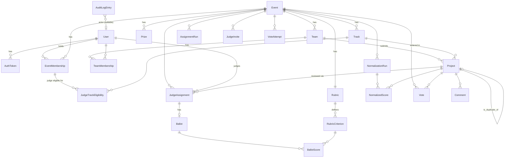

# DATA-MODEL.md — Schema, constraints, and how data gets in and out

This document describes Rubric's database schema, the reasoning behind its
shape, how the published fixture data maps onto it, and the paths an organizer
has for importing and exporting data. Table and column names are the real ones
(PostgreSQL is the production database; the same models run on SQLite for tests).

## Contents

1. [Design principles](#1-design-principles)
2. [Entity overview](#2-entity-overview)
3. [Tables by area](#3-tables-by-area)
4. [Constraints that carry the guarantees](#4-constraints-that-carry-the-guarantees)
5. [Getting data in](#5-getting-data-in)
6. [Getting data out (and leaving)](#6-getting-data-out-and-leaving)
7. [Fixture data: mapping and the deliberate edge cases](#7-fixture-data-mapping-and-the-deliberate-edge-cases)
8. [Privacy and retention](#8-privacy-and-retention)
9. [Known gaps in the model](#9-known-gaps-in-the-model)

---

## 1. Design principles

- **The file is input, not the model.** `fixtures.json` is loaded and
  transformed into a normalized relational schema. Nothing in the schema mimics the
  file's shape.
- **Provenance is explicit.** Every entity that can come from an import carries a
  nullable, unique `external_id` (`prj_07`, `jdg_07`, …). Importing is therefore
  idempotent, and tests and documentation can refer to real records.
- **Nothing that matters is deleted.** Duplicate submissions are flagged, comments
  are hidden, vote attempts and audit entries are append-only. History is annotated,
  not rewritten.
- **The database enforces what it can.** Uniqueness of votes, of assignments, of
  scores and of the "current" event are database constraints, not just checks in
  code.
- **No raw secrets or identifiers at rest where a hash will do.** Tokens, invite
  links and IP addresses are stored as hashes; voter identities as keyed pseudonyms.
- **Portable types.** Tags and audit payloads use `JSONField` rather than
  PostgreSQL-specific arrays, keeping SQLite and PostgreSQL behavior identical.

## 2. Entity overview

## 3. Tables by area

### 3.1 Accounts and roles

| Table | Purpose | Key columns and rules |
|---|---|---|
| `accounts_user` | One row per person | `email` (unique), `display_name`, `is_site_admin`, `external_id` (nullable unique), password hash (unusable for imported fixture users). |
| `accounts_authtoken` | Login and API tokens | `token_hash` (SHA-256, unique) — the raw token is never stored; `label`, `expires_at` (nullable). |
| `accounts_eventmembership` | A user's role in an event | `(event, user, role)` unique; role is `PARTICIPANT`, `JUDGE` or `ORGANIZER`. One user may hold several roles. |
| `accounts_judgetrackeligibility` | Which tracks a judge may review | `(event_membership, track)` unique. Imported from each fixture judge's `tracks` array; used as a hard constraint by assignment. |
| `accounts_authattempt` | Login/registration rate limiting | `ip_hash` (keyed HMAC, not the IP), `action`, `created_at`; indexed for the sliding-window query. |

### 3.2 Events

| Table | Purpose | Key columns and rules |
|---|---|---|
| `events_event` | A hackathon | `slug` unique; `submissions_open_at` (optional), `submissions_close_at` (required); voting settings: `voting_opens_at`, `voting_closes_at`, `voting_access` (`OPEN`/`AUTH`), `votes_per_voter` (null = one vote per project, uncapped), `voting_seed` (random, non-editable, feeds pseudonyms and ballot order); `is_current` with a **partial unique index** so at most one event is current. |
| `events_track` | A competition track | belongs to an event; `external_id`. |
| `events_prize` | A prize | `rank_label`, `description`; belongs to an event. |

### 3.3 Teams and submissions

| Table | Purpose | Key columns and rules |
|---|---|---|
| `teams_team` | A team in an event | `invite_code` (unique); imported teams get a deterministic code. |
| `teams_teammembership` | Team members | `(team, user)` unique. |
| `submissions_project` | A submission | `title`, `summary`, `description`; `repo_url`, `demo_video_url`, `live_url` (validated as absolute `http(s)` URLs by the service); `tech_tags` and `custom_answers` as JSON; `status` (`DRAFT`/`SUBMITTED`); `submitted_at`; **`is_duplicate_of`** (self-reference, `SET NULL`), `duplicate_flag_reason`, `duplicate_override` (an organizer's restore). |

### 3.4 Judging

| Table | Purpose | Key columns and rules |
|---|---|---|
| `judging_rubric` | The event's rubric | Exactly one per event (unique). |
| `judging_rubriccriterion` | A scoring criterion | `name` unique per rubric; `weight` (decimal), `max_score`, `order`. |
| `judging_judgeassignment` | Judge ↔ project | `(judge, project)` unique; `status` `PENDING`/`COMPLETED`; belongs to an event. |
| `judging_ballot` | One judge's review of one project | one-to-one with the assignment; `comment`, `is_complete`, `submitted_at`. |
| `judging_ballotscore` | One criterion's score | `(ballot, criterion)` unique; `value` (decimal). |
| `judging_normalizationrun` | One computation | `method_name`, `parameters` (JSON: pooled mean and variance, judge statistics, per-judge contributions, components, project flags and review counts), `computed_at`. Runs are records, never edited. |
| `judging_normalizedscore` | Per-project result of a run | `(run, project)` unique; `raw_mean`, `normalized_mean`, `rank`, `judge_graph_component_id`, `judge_graph_fiedler_value`. |
| `judging_assignmentrun` | One assignment computation | `target_k`, `seed`, `under_coverage` (JSON), `connectivity_report` (JSON), `anchor_injections` (JSON). |
| `judging_judgeinvite` | A judge invitation | `token_hash` (unique; the link is shown once), `email`, `expires_at`, `accepted_at` (single use), invited tracks. |

### 3.5 Public voting

| Table | Purpose | Key columns and rules |
|---|---|---|
| `voting_voteattempt` | **Append-only** log of every cast, withdrawal or refusal | `mode`, `voter_fingerprint` (keyed pseudonym), `outcome` (`ACCEPTED`, `REJECTED_DUPLICATE`, `REJECTED_RATE_LIMIT`, `REJECTED_CLOSED`, `REJECTED_BUDGET`, `WITHDRAWN`), `created_at`. Update and delete are refused by the model layer. Indexed for the rate-limit window. Rows are protected from cascade deletion. |
| `voting_vote` | Currently valid votes (fast tallying) | **unique `(event, project, mode, voter_fingerprint)`**; `weight` (reserved, default 1); links to its attempt. |
| `voting_comment` | Public comments | `author` (nullable), `mode`, `voter_fingerprint`, `body`, `is_flagged` — flagged comments are hidden, never deleted. |

### 3.6 Audit

| Table | Purpose | Key columns and rules |
|---|---|---|
| `audit_auditlogentry` | Tamper-evident history | `seq` (primary key, strictly increasing), `actor_user` (nullable), `actor_label`, `action`, `target_type`, `target_id`, `payload` (JSON), `created_at` (stored as text so the hashed form is exact), `prev_hash`, `entry_hash`. On PostgreSQL, triggers reject update, delete and truncate. |
| `audit_auditchainhead` | Chain head | A single row (constraint `id = 1`) holding the last `seq` and hash; locked while appending. |

## 4. Constraints that carry the guarantees

| Guarantee | Enforced by |
|---|---|
| At most one current event | Partial unique index on `events_event(is_current) WHERE is_current` |
| One vote per identity per project per mode | Unique `(event, project, mode, voter_fingerprint)` |
| No double assignment of a judge to a project | Unique `(judge, project)` |
| One score per criterion per ballot | Unique `(ballot, criterion)` |
| One ballot per assignment | One-to-one |
| One rubric per event; unique criterion names | Unique constraints |
| A user holds a given role in an event once | Unique `(event, user, role)` |
| Team invite codes and imported ids cannot collide | Unique `invite_code`, unique `external_id` on each imported entity |
| Audit history cannot be altered | PostgreSQL triggers; ORM guards; hash chain |
| Vote abuse evidence cannot be rewritten in code | ORM guards on `VoteAttempt` (not a database trigger) |
| Only one row of chain head | Check constraint `id = 1` |

## 5. Getting data in

| Path | What it does |
|---|---|
| **Fixture import** — `python manage.py seed_fixtures [--fixtures path]` | Idempotent by `external_id`. Loads an event, tracks, judges (with track eligibility), teams (with members), projects and scores from a JSON file shaped like `fixtures.json` (event, tracks, judges, teams, projects, scores). It creates a default three-criterion rubric with equal weights, flags duplicate submissions, and backfills scores as completed history. Runs automatically on `docker compose up`. |
| **Demo logins** | By default the import prints four demo tokens (organizer, two judges, a participant) that the acceptance checker attaches. `RUBRIC_SEED_DEMO_LOGINS=false` disables them for real deployments. |
| **Organizer bootstrap** — `python manage.py create_organizer --email … --password …` | Creates an organizer account for the current event. |
| **Participants** | Register, then create a team or join by invite link, then submit through the UI. |
| **Judges** | Organizer creates an expiring, single-use invitation link (stored hashed); the judge registers or signs in and accepts it. |
| **Event setup** | Dates, tracks, prizes, rubric, voting settings are edited by the organizer in the UI; each change is audit-logged with before/after values. |

Not provided: a generic CSV/JSON bulk importer for arbitrary platforms. The
fixture format is the supported bulk-import shape.

## 6. Getting data out (and leaving)

A platform you cannot leave is a trap, so every kind of data has an export that
does not depend on the application UI.

| Export | How | Contents |
|---|---|---|
| **Results CSV** | `GET /api/export.csv` (organizer) | Columns: `project_id` (the fixture id, e.g. `prj_41`, or `project:<id>` for projects created in the app), `raw_mean`, `normalized_mean`, `rank`, `review_count`, `flags`. Uses the latest normalization run; computes one if none exists. The `flags` field uses only the canonical tokens `thin_batch`, `constant_judge`, and `duplicate`, separated by semicolons. |
| **Judge score reads** | `GET /api/judge/scores` (judges: own; organizers: any) | JSON of ballots and scores. |
| **Normalization proof table** | `/organizer/normalization` (download) or `python manage.py export_normalization_proof <run_id> --output proof.csv` | Raw mean, normalized mean and rank change per project from a stored run; needs no running web server. |
| **Audit chain** | `/api/v1/organizer/audit-log/verify?download=1` | The full chain as JSON, verifiable offline with `scripts/verify_audit_chain.py` (standard library only). |
| **Progress and voting summaries** | `/api/v1/organizer/progress`, `/api/v1/organizer/voting/summary` | JSON. |
| **The database itself** | `pg_dump` | The schema is plain relational PostgreSQL with no proprietary types or extensions; the tables in §3 can be read with any SQL client. |

To leave completely: dump the database (everything), keep the CSV and the audit
export (the parts that should outlive the application), and verify the chain offline.

## 7. Fixture data: mapping and the deliberate edge cases

| Fixture record | Becomes |
|---|---|
| `event` | `events_event` (`external_id = evt_01`, `submissions_close_at` from `submissions_close`, the real date in the past, so the closed-event acceptance check passes because the seed is honest) |
| `tracks[]` (8) | `events_track` |
| `judges[]` (30) | `accounts_user` (imported judges have no usable password) + `EventMembership(JUDGE)` + one `JudgeTrackEligibility` per listed track |
| `teams[]` (40) | `teams_team` + `TeamMembership` (members matched by email) |
| `projects[]` (41) | `submissions_project`, all `SUBMITTED`, with `submitted_at` from the file |
| `scores[]` (126) | `JudgeAssignment(COMPLETED)` + `Ballot(is_complete)` + one `BallotScore` per criterion. Fixture scores carry no timestamp, so `Ballot.submitted_at` is the **import time** and means "this data existed as of import", not a judging-time claim. |

The fixture's three deliberate edge cases are handled explicitly:

- **Duplicate submission.** Team `tm_07` submitted "Dry Harbour" twice. The importer
  detects the pair (same team, near-identical title, close in time) and sets
  `prj_07.is_duplicate_of = prj_41` — the earlier entry is flagged, the later one
  canonical. Both rows exist; the flag records why; an organizer can restore the
  earlier one.
- **Constant weighted-ballot judges.** `jdg_07` scored all three criteria identically
  on each counted assignment, so is constant at the criterion level. `jdg_19` has
  differing criterion scores, but after excluding superseded `prj_07`, all three
  counted ballots have the same weighted value (11/3 under the default equal-weight
  rubric). Both are flagged for zero variance in weighted ballot values when there
  are at least two counted ballots. These are distinct patterns, not the same scoring
  behavior. Scores stay stored as
  given and are handled by the normalization method (`JUDGING.md` §4).
- **Thin review batches.** Eight projects have two ballots instead of three. Stored
  as given; the count travels with every ranked output.

Imported scores also have a consequence for statistics: `prj_07`'s five ballots are
retained but excluded from ranking, leaving 121 counted ballots from 29 judges.

## 8. Privacy and retention

- Tokens, judge-invite links and login-attempt IPs are stored as hashes.
- Vote identities are keyed pseudonyms: AUTH derives one from the account id, while
  OPEN uses `REMOTE_ADDR` only. No raw IP address, user agent or account id is stored
  on a vote, and voting audit entries carry no user (`JUDGING.md` §6.4).
- Comments are attributed to their author; imported users have no usable password.
- There is no automatic data expiry. Retention is the operator's decision; the
  export paths in §6 exist so data can be archived or removed deliberately. Because
  the audit log is append-only, removing a person's data means removing or
  redacting rows in the application tables, not editing history.

## 9. Known gaps in the model

- `judging_normalizedscore` has two columns for rank-interval bounds
  (`rank_ci_low`, `rank_ci_high`) that no code populates. They are reserved.
- `voting_vote.weight` is reserved for a future weighted-voting mode and is always 1.
- `VoteAttempt` immutability is enforced in application code, not by a database
  trigger (the audit log is trigger-protected on PostgreSQL).
- Teams do not carry a track and there is no per-track team-size limit.
- `NormalizedScore` has no dedicated columns for review counts, project flags, raw
  rank or rank change. The run's JSON `parameters` stores review counts and project
  flags; the proof export derives rank change from raw and normalized ranks. The JSON
  is the authoritative record of those run-level flags and counts.
